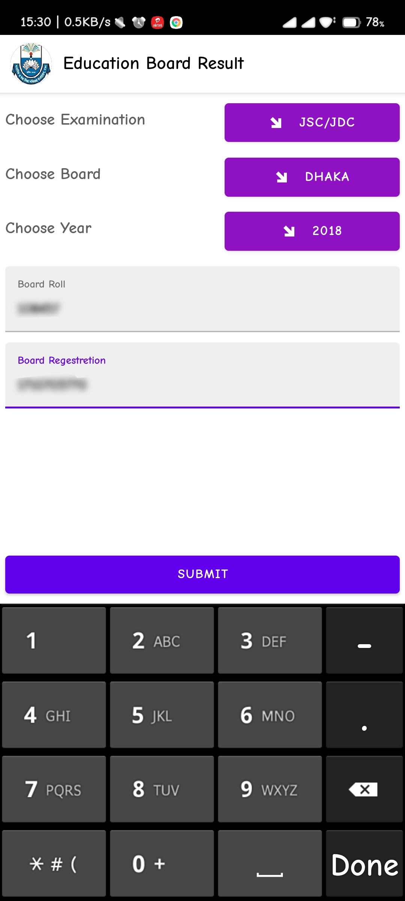
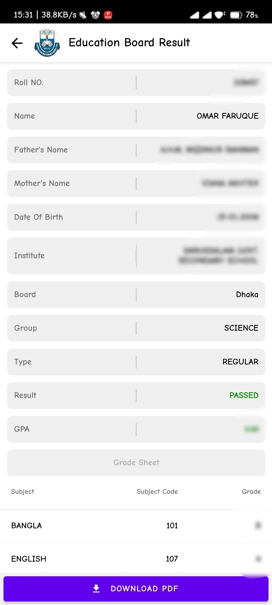

<div id="top"></div>

<!-- PROJECT LOGO -->
<br />
<div align="center">
  <a href="https://github.com/github_username/repo_name">
    
  </a>

# **Education Board Result (EBR)**

  <p align="center">
    EBR is a android app that help to get Board Exam's Result easily and generate a printable PDF file. 
    <br />
    <br />
    <a href="https://github.com/OmarFaruk-0x01/Education-Board-Results/issues">Report Bug</a>
    ·
    <a href="https://github.com/OmarFaruk-0x01/Education-Board-Results/issues">Request Feature</a>
  </p>
</div>


<!-- TABLE OF CONTENTS -->
<details open>
  <summary>Table of Contents</summary>
  <ol>
    <li>
      <a href="#about-the-project">About The Project</a>
      <ul>
        <li><a href="#built-with">Built With</a></li>
      </ul>
    </li>
    <li>
      <a href="#getting-started">Getting Started</a>
      <ul>
        <li><a href="#prerequisites">Prerequisites</a></li>
        <li><a href="#installation">Installation</a></li>
      </ul>
    </li>
    <li><a href="#usage">Usage</a></li>
    <li><a href="#roadmap">Roadmap</a></li>
    <li><a href="#contributing">Contributing</a></li>
    <li><a href="#license">License</a></li>
    <li><a href="#contact">Contact</a></li>
    <li><a href="#acknowledgments">Acknowledgments</a></li>
  </ol>
</details>


<!-- ABOUT THE PROJECT -->
## About The Project

<div style="display:flex; flex-wrap: wrap;gap: 10px">



</div>

EBR is a mobile version of educationboardresults.gov.bd with some extra features e.g. Generating PDF, and clean UI. This app was made with React Native as a Frontend Technology and Python Flask as a Backend Technology. This app will help those people who can't use websites. People can easily get their results and also generate PDF in one click.  

<p align="right">(<a href="#top">back to top</a>)</p>


## Built With 
#### Frontend Technology  
* [React Native](https://reactnative.dev/)
* [React Native Paper](https://reactjs.org/) 

#### Backend Technology  
* [Python Flask](https://svelte.dev/) 
* [BeautifulSoup4](https://pypi.org/project/beautifulsoup4/)
* [HTML to PDF]()

<p align="right">(<a href="#top">back to top</a>)</p>


### Prerequisites
There are some prerequisites to run this app and server

* **NPM**
  
  Follow the instruction to install [node-js & npm](https://nodejs.org/de/download/package-manager/)

* **Python3**
  <details>
  <summary>Linux</summary>
  
  ```sh
  sudo apt-get install python3
  sudo apt-get instsll python3-pip
  ```
  </details>
  <details>
  <summary >MacOS</summary>
  
  ```sh
  brew instsll python3 python3-pip
  ```
  </details>
  <details>
  <summary>Windows</summary>
  Download Python Binary by <a href="https://www.python.org/ftp/python/3.10.4/python-3.10.4-amd64.exe" download>clicking here</a> 
  </details>
  <br>
* **React Native**<br>
  React native has a greate [documentation](https://reactnative.dev/docs/environment-setup) for enviroment setup 


## Installation
### Frontend
1. Clone the repo
     ```sh
   git clone https://github.com/OmarFaruk-0x01/Education-Board-Results
   ```
2. Install NPM packages
   ```sh
   npm install
   ```
3. Run the command to start application.
   ```sh
   npx react-native run-android 
   npx react-native start
   ```
### Backend
1. Install dependencies 
   ```sh
   pip3 install -r requirements.txt
   ```
2. Run the server
   ```sh
   python3 main.py
   ```

<p align="right">(<a href="#top">back to top</a>)</p>


<!-- USAGE EXAMPLES -->
## Usage

Use this space to show useful examples of how a project can be used. Additional screenshots, code examples and demos work well in this space. You may also link to more resources.

_For more examples, please refer to the [Documentation](https://example.com)_

<p align="right">(<a href="#top">back to top</a>)</p>


<!-- ROADMAP -->
## Roadmap

- [ ] 
- [ ] Feature 2
- [ ] Feature 3
    - [ ] Nested Feature

See the [open issues](https://github.com/github_username/repo_name/issues) for a full list of proposed features (and known issues).

<p align="right">(<a href="#top">back to top</a>)</p>


<!-- MARKDOWN LINKS & IMAGES -->
<!-- https://www.markdownguide.org/basic-syntax/#reference-style-links -->
[contributors-shield]: https://img.shields.io/github/contributors/github_username/repo_name.svg?style=for-the-badge
[contributors-url]: https://github.com/github_username/repo_name/graphs/contributors
[forks-shield]: https://img.shields.io/github/forks/github_username/repo_name.svg?style=for-the-badge
[forks-url]: https://github.com/github_username/repo_name/network/members
[stars-shield]: https://img.shields.io/github/stars/github_username/repo_name.svg?style=for-the-badge
[stars-url]: https://github.com/github_username/repo_name/stargazers
[issues-shield]: https://img.shields.io/github/issues/github_username/repo_name.svg?style=for-the-badge
[issues-url]: https://github.com/github_username/repo_name/issues
[license-shield]: https://img.shields.io/github/license/github_username/repo_name.svg?style=for-the-badge
[license-url]: https://github.com/github_username/repo_name/blob/master/LICENSE.txt
[linkedin-shield]: https://img.shields.io/badge/-LinkedIn-black.svg?style=for-the-badge&logo=linkedin&colorB=555
[linkedin-url]: https://linkedin.com/in/linkedin_username
[ps1]: Screenshots/EBR1.jpg
[ps2]: Screenshots/EBR2.jpg
[ps3]: Screenshots/EBR3.jpg
[ps4]: Screenshots/EBR4.jpg
