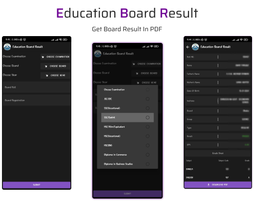

<div id="top"></div>
<!-- PROJECT LOGO -->
<br />
<div align="left" style="display:flex">
<div align="center" style="display:flex; align-items: center; justify-content: center; margin-right: 10px">
  <a href="https://github.com/github_username/repo_name" >
    
  </a>
</div>
<div>

## **Education Board Result (EBR)**
  <p align="left">
    EBR is a android app that help to get Board Exam's Result <br>easily and generate a printable PDF file. 
    <br />
    <br />
    <a href="https://github.com/OmarFaruk-0x01/Education-Board-Results/issues">Report Bug</a>
    ·
    <a href="https://github.com/OmarFaruk-0x01/Education-Board-Results/issues">Request Feature</a>
  </p>
</div>
</div>


<!-- TABLE OF CONTENTS -->
<details open >
  <summary style="cursor: pointer;">Table of Contents</summary>
  <ol>
    <li>
      <a href="#about-the-project">About The Project</a>
      <ul>
        <li><a href="#deatures-with-snapshots">Features with Snapshots</a></li>
        <li><a href="#built-with">Built With</a></li>
      </ul>
    </li>
        <li><a href="#prerequisites">Prerequisites</a></li>
    <li>
      <a href="#installation">Installation</a>
      <ul>
        <li><a href="#frontend">Frontend</a></li>
        <li><a href="#backend">Backend</a></li>
      </ul>
    </li>
    <li>
      <a href="#setup_run">Setup & Run</a>
    </li>
    <li><a href="#roadmap">Roadmap</a></li>
   
  </ol>
</details>


<!-- ABOUT THE PROJECT -->
## About The Project
<div align="center">

</div><br>
EBR is a mobile version of educationboardresults.gov.bd with some extra features e.g. Generating PDF, and clean UI. The app was made with React Native as a Frontend Technology and Python Flask as a Backend Technology. The app will help those people who can't use websites. People can easily get their results and also generate PDF in one click.  

<p align="right">(<a href="#top">back to top</a>)</p>

## Features with Snapshots
1. All Exam Boards, Exam Year and Exam name selections and Board Roll Reg input with classic UI.
   <details ><summary>snapshot</summary>

   ![Feature_1][ps1]

   </details>
2. Results are beautifully organized with GPAs and PDF generation
   <details ><summary>snapshot</summary>

   ![Feature_2][ps2]

   </details>
3. Server side printable PDF generation. In one click.
   <details ><summary>snapshot</summary>

   ![Feature_3][ps3]

   </details>
4. Save Your Result's PDF in your storage
   <details ><summary>snapshot</summary>

   ![Feature_3][ps4]

   </details>
## Built With 
#### Frontend Technology  
* [React Native](https://reactnative.dev/)
* [React Native Paper](https://reactjs.org/) 

#### Backend Technology  
* [Python Flask](https://svelte.dev/) 
* [BeautifulSoup4](https://pypi.org/project/beautifulsoup4/)
* [HTML to PDF]()

<p align="right">(<a href="#top">back to top</a>)</p>


## Prerequisites
There are some prerequisites to run this app and server

* **NPM**
  
  Follow the instruction to install [node-js & npm](https://nodejs.org/de/download/package-manager/)
######
* **Python3**
  <details>
  <summary>Linux</summary>
  
  ```sh
  sudo apt-get install python3
  sudo apt-get instsll python3-pip
  ```
  </details>
  <details>
  <summary >MacOS</summary>
  
  ```sh
  brew instsll python3 python3-pip
  ```
  </details>
  <details>
  <summary>Windows</summary>
  Download Python Binary by <a href="https://www.python.org/ftp/python/3.10.4/python-3.10.4-amd64.exe" download>clicking here</a> 
  </details>
##### 
* **React Native**
  React native has a greate [documentation](https://reactnative.dev/docs/environment-setup) for enviroment setup 


## Installation
### Frontend
1. Clone the repo
     ```sh
   git clone https://github.com/OmarFaruk-0x01/Education-Board-Results
   ```
2. Goto to the Frontend Folder
    ```sh
    cd Frontend
    ```
4. Install NPM packages
   ```sh
   npm install
   ```
4. Run the command to start application.
   ```sh
   npx react-native run-android 
   npx react-native start
   ```

### Backend
1. Goto to the Backend Folder
    ```sh
    cd Backend
    ```
2. Install dependencies 
   ```sh
   pip3 install -r requirements.txt
   ```
3. Run the server
   ```sh
   python3 main.py
   ```

<p align="right">(<a href="#top">back to top</a>)</p>


<!-- Setup Projects -->
<div id="setup_run"></div>

## Setup & Run
Now you have to run some commands to start the app.
### Frontend
1. To run the application
   ```sh
   cd Frontend
   npx react-native run-android # 'run-ios' if you are in macOS
   ```
2. To start the developement server
   ```sh
   npx react-native start
   ```
3. To make a Release Build follow [the article][release_build_article].
   
### Backend
Use those commands to run the backend server.
   ```sh
   cd Backend
   python3 main.py
   ```
**Any Issue?**
If there are any connection issue with localhost server then use [Ngrok][ngrok_url] or any other porxy.
You can change server host url from `Frontend/src/Constants/index.js` this file.
 
```js
const BASEURL = "<Your ngrok/proxy url>";
 ```

<p align="right">(<a href="#top">back to top</a>)</p>


<!-- ROADMAP -->
## Roadmap
#### Frontend
- [x] Create two screens. 
  - [x] 1st screen for taking informations and 
  - [x] 2nd screen for showing the results in a organized way.
- [x] Create Static Constant Data of Exam Boards, Exams and Years.
- [x] Create DropDown Button Component take Datas and title with Props
- [x] Link Constant Data with dropdown components
- [x] Take Informations and send it to the server when Submit button will be pressed. 
- [x] When get the results, move it to the 2nd screen and organized them. 
- [x] When `Download PDF` button pressed. results send to the server and Generate A PDF. after generating download and save it to the storage.

#### Backend
- [x] Create a Request Session.
- [x] Send a `GET` request to the [Education Board Result][eduresultgov] and parse the HTML with BeautifulSoup4.
- [x] Findout the all input fields
- [x] Calculate the *Captcha* and send a `POST` request to the `result's route` with all input fields and captcha. 
- [x] After getting the results parse the HTML and get all information. 
- [x] Make a JSON object with all result information and send to client.
- [x] After getting a `POST` request to the `/genPDF` route with Result Data. Create a PDF and save it to the server storage and generate a link and send it to the client.
- [x] After getting a `GET` request to the `/getPDF` route with PDF id. Send the PDF to the client. 


<p align="right">(<a href="#top">back to top</a>)</p>


<!-- [stars-url]: https://github.com/github_username/repo_name/stargazers
[issues-url]: https://github.com/github_username/repo_name/issues
[linkedin-shield]: https://img.shields.io/badge/-LinkedIn-black.svg?style=for-the-badge&logo=linkedin&colorB=555 -->

[linkedin-url]: https://linkedin.com/in/linkedin_username
[ps1]: Screenshots/EBR1.jpg
[ps2]: Screenshots/EBR2.jpg
[ps3]: Screenshots/EBR3.jpg
[ps4]: Screenshots/EBR4.jpg
[release_build_article]: https://instamobile.io/android-development/generate-react-native-release-build-android/
[ngrok_url]: https://ngrok.com/
[eduresultgov]: http://www.educationboardresults.gov.bd/